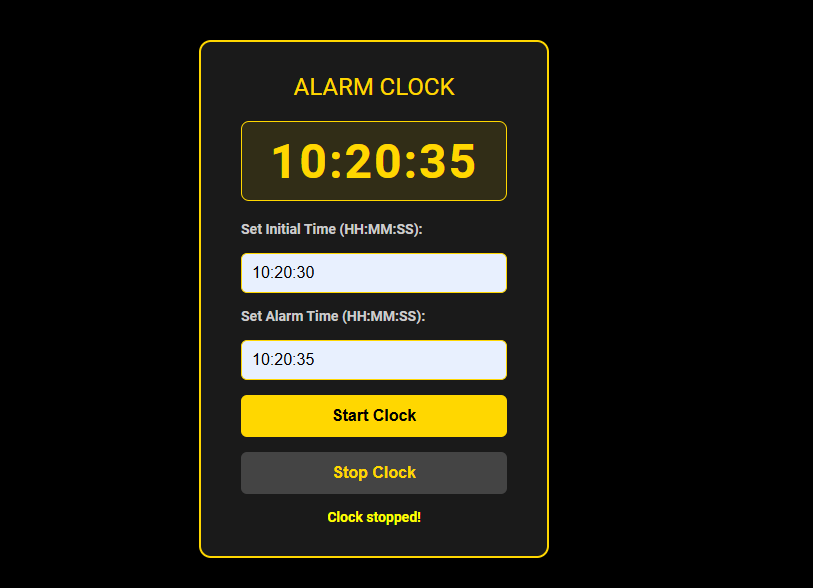

# AlarmClock Project

## Overview
The **AlarmClock Project** is a JavaScript-based project that showcases a clock functionality with alarm capabilities. This project is designed in two versions:

1. **AlarmClock**: Displays time and alarm functionalities directly in the console.
2. **AlarmClockV2**: Enhances the project with an interactive HTML and CSS-based user interface.

This project demonstrates object-oriented programming principles, including inheritance, private methods, and encapsulation, with the use of ES6+ features in JavaScript.

---

## Screenshots

### AlarmClockV2 UI

---

## Features

### AlarmClock
- Display the current time in the console.
- Alarm feature to trigger at a specified time.
- Easy-to-use start, stop, and alarm set methods.

### AlarmClockV2
- **HTML/CSS UI**:
  - Displays a real-time clock.
  - Set and display alarms using a user-friendly interface.
- **Dynamic Interaction**:
  - Start and stop the clock through the interface.
  - Receive visual alerts for the alarm.

---

## How to Use

### For AlarmClock:
1. Clone the repository.
2. Open the project directory.
3. Run `main.js` in a JavaScript console-enabled environment (e.g., a browser’s developer tools or Node.js).

### For AlarmClockV2:
1. Clone the repository.
2. Open `index.html` in your preferred browser.
3. Interact with the user interface to set alarms and view the clock.

---

## Contact

For any inquiries or feedback, feel free to reach out:

- **Email**: [Send Mail](mailto:aa2447454@gmail.com)
- **LinkedIn**: [Abdallah Ali’s LinkedIn](https://www.linkedin.com/in/abdallah-ali98/)

---

Thank you for checking out the AlarmClock project!

